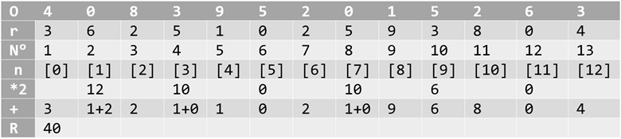

# Tarjeta de crédito válida

## Índice

* [1. Proyecto](#1-proyecto)
* [2. Consideraciones para el usuario](#2-consideraciones-para-el-usuario)
* [3. Pruebas unitarias de los metodos](#3-pruebas-unitarias-de-los-metodos)
* [4. Consideraciones técnicas](#4-consideraciones-técnicas)
* [5. Descripción de los archivos](#5-descripción-de-los-archivos)

***

## 1. Proyecto

El proyecto se basa en una interfaz que debe permitir al usuario:

* Insertar un numero (texto) que quieres validar. Usa solo caracteres numéricos
  (dígitos) en la tarjeta a validar [0-9].  
* Ver si el resultado es válido o no.  
* Ocultar todos los dígitos del número de tarjeta a excepción de los últimos
  4 caracteres.  
* No debes poder ingresar un campo vacío.

Para lograr estos objetivos y que la pagina sea agradable con el usuario primero diseñe como sería el formato que utilizaría en HTML, así como algunos de los estilos. 
Para realizar la validación se usa el algoritmo de Luhn, al investigar encontré que es:

[Algoritmo de Luhn](https://en.wikipedia.org/wiki/Luhn_algorithm)

También llamado módulo de 10 es un método de suma de verificación, que se utiliza para validar números de identificación; tales como los IMEI de los celulares, tarjetas de crédito, etc.
Este algoritmo es simple. Obtenemos la reversa del número a verificar (que solo contiene dígitos [0-9]) a todos los números que ocupan una posición par se les debe multiplicar por dos, si ese número es mayor o igual a 10, debemos sumar los dígitos del resultado; el numero a verificar será válido si la suma de sus dígitos finales es un múltiplo de 10.

* En el input o textarea se lee el valor ingresado, por ejemplo: 4083 9520 15263.
* Después se le aplica una reversa es decir el que era el primer número pasa a ser el último y el ultimo el primero (en la imagen donde O es el numero original, r es la reversa, N° es la posición de cada número y n es la posición que le asigna cuando usamos JavaScript) 
* Se debe multiplicar los que quedan en lugares pares (en la imagen *2 es la multiplicación de los pares)
* Si en la multiplicación la suma da un numero mayor de 10 entonces se suman los dígitos (como aparece en la imagen en +)
* Después sumamos los dígitos impares con los productos de la multiplicación. El numero a verificar será válido si la suma de sus dígitos finales es un múltiplo de 10 es un numero valido, si no es múltiplo es incorrecto.



## 2. Consideraciones para el usuario

Algunas de las funciones están diseñadas para que sean visuales, algunas otras son hacerle saber al usuario lo que se debe ingresar en cada uno de los campos, si bien en las pestañas que incluyo aun no se ha agregado una funcionalidad la parte de validación de tarjeta de crédito es la que tenía que resaltar para cumplir con las consideraciones del proyecto.

Al igual que el usuario al ingresar campos vacíos lo redirecciona en el campo que hace falta por llenar, le indica los caracteres que puede usar y al final se muestra el numero de la tarjeta con una máscara, así como si esta es válida o no.

* Quiénes son los principales usuarios de producto. los que quieran hacer una validación de una tarjeta de crédito.

## 3. Pruebas unitarias de los metodos

Los metódos de `validator` (`isValid` y `maskify`) deben tener cobertura con
pruebas unitarias. Estos se explicaran más adelante.

## 4. Consideraciones técnicas

La estructura del proyecto es la siguiente:

```text
./
├── .babelrc
├── .editorconfig
├── .eslintrc
├── .gitignore
├── README.md
├── package.json
├── src
│   ├── validator.js
│   ├── index.html
│   ├── index.js
│   └── style.css
└── test
    ├── .eslintrc
    └── validator.spec.js
```

### 5 Descripción de los archivos

* `README.md`: Explica la información necesaria para el uso de la aplicación
  web, así como una introducción a la aplicación, su funcionalidad y decisiones de
  diseño que tomaron.
* `src/index.html`: este es el punto de entrada a la aplicación.
* `src/style.css`: este archivo debe contener las reglas de estilo.
* `src/validator.js`: Este objeto (`validator`) contiene dos
  métodos:
  - `validator.isValid(creditCardNumber)`: `creditCardNumber` es un `string`
     con el número de tarjeta que se va a verificar. Esta función retorna
     un `boolean` dependiendo si es válida o no la tarjeta esto de acuerdo al [algoritmo de Luhn](https://en.wikipedia.org/wiki/Luhn_algorithm).
  - `validator.maskify(creditCardNumber)`: `creditCardNumber` es un `string` con
    el número de tarjeta y esta función retorna un `string` donde todos menos
    los últimos cuatro caracteres sean reemplazados por un numeral (`#`).
    Esta función deberá siempre mantener los últimos cuatro caracteres
    intactos, aún cuando el `string` sea de menor longitud.

    Ejemplo de uso

    ```js
    maskify('4556364607935616') === '############5616'
    maskify(     '64607935616') ===      '#######5616'
    maskify(               '1') ===                '1'
    maskify(               '')  ===                ''
    ```

* `src/index.js`: acá debes escuchar eventos del DOM, invocar
  `validator.isValid()` y `validator.maskify()` según sea necesario y
  actualizar el resultado en la UI (interfaz de usuario).
* `test/validator.spec.js`: este archivo contiene algunos tests de ejemplo para `validator.isValid()` y `validator.maskify()`.

***
